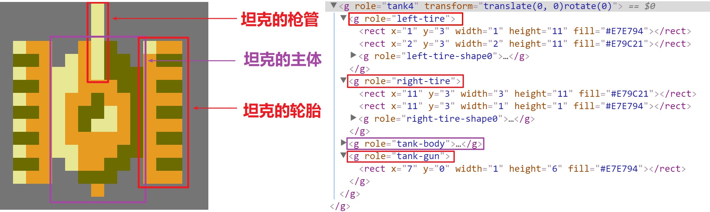

# 用 React 与 Redux-saga 实现的高质量坦克大战复刻版

_TODO 坦克大战介绍_

游戏主要包括几个方面的内容：一素材 二数据 三展现 四逻辑 五电脑玩家

## 一、素材

素材主要包括了以下各方面的内容：

1.  图片素材：例如坦克的形状/颜色, 各种地形的颜色/样子等
2.  关卡配置：每一关的战场地形配置，一关内会出现的敌对坦克的数量和等级；
3.  数值配置：例如子弹的速度，坦克的移动速度，道具铲子的持续时间等；
4.  游戏场景：游戏开始/结束场景，关卡结算场景等；
5.  音效（音效部分尚未完成）。

#### 图片素材

图片素材可以从网上下载得到， [该位图图片](/resources/General-Sprites.png) 中包含了坦克大战绝大部分的图片素材。因为复刻版使用矢量图来展现画面, 所以需要对位图进行矢量化处理。位图图片中的每个像素点, 都要转换为 SVG 中 1x1 的小矩形，这样整个游戏才会呈现像素风格。素材也可以适当地转换为 SVG 矩形元素或是 SVG 路径元素，以减少元素的数量，提升渲染性能。

大部分的素材，都是通过手工输入的方式得到的。例如坦克生成时的闪光效果，其颜色为白色，形状可认为是若干个矩形的叠加，我使用若干个矩形元素就能表示闪光效果了。

对于一些比较复杂的素材，我将其分解为若干个部分，对每个部分进行矢量化，然后组装起来得到整体素材。例如，_app/components/tanks.tsx_ 中将坦克分解为若干部分:

```
左侧的轮胎(left-tire)：
	轮胎的背景色
	轮胎上的花纹
右侧的轮胎(right-tire)：
	轮胎的背景色
	轮胎上的花纹
坦克主体(tank-body)：
	坦克主体的轮廓
	坦克主体上的装饰
坦克炮管(gun)：一个矩形
```



一些素材的形状具有一定的模式，此时可以采用循环/分支的方式来生成所需要的 SVG 元素。例如一个完整的砖墙的大小为 16x16，但是砖墙的左上/右上/左下/右下四个部分是完全一样的，有了砖墙左上部分(8x8)的 SVG 之后，使用循环可以生成整个砖墙。

一些素材的形状非常不规则，难以通过手工的方式进行输入，例如子弹/坦克的爆炸效果, 掉落道具的形状。我使用脚本读取原始素材中每个像素点的颜色值，然后将其转换为一个字符，用于保存该点的颜色值。React 渲染时, 根据字符渲染出对应颜色的矩形(1x1)。该方式可以方便地对素材进行矢量化，但是会导致 React 组件数量大大增加，降低渲染效率。

素材矢量化的过程非常灵活，复刻版充分利用了循环/分支/组合简化了矢量化过程。[elements.tsx 文件](/app/components/elements.tsx)中的 `<Pixel />` 与 `<BitMap />` 组件在矢量化的过程中提供了很大的便利，可供参考。一项素材完成矢量化之后，可以将其放在 [Gallery 页面](http://shinima.pw/battle-city/#/gallery) 进行查看，和原始素材进行对比，方便改正其中的错误。

#### 关卡配置

[坦克大战 WIKI](https://strategywiki.org/wiki/Battle_City)上有完整的关卡配置表，根据配置表使用关卡编辑器生成关卡配置 json 文件即可，[关卡列表](http://shinima.pw/battle-city/#/list)中已经列出了所有游戏自带的关卡，玩家也可以使用关卡编辑器创建自定义关卡，自定义关卡数据将保存在 localStorage 中。

#### 数值配置

一部分数值配置比较明显，多玩几遍原版游戏就可以找到规律，例如玩家的坦克数量、坦克升级过程、不同类型坦克子弹效果、击毁不同类型坦克的得分等。其他数值配置的获取较为繁琐，例如子弹飞行速度、坦克移动速度、爆炸效果各帧的持续时间，这一部分大都从原版游戏录像中获取。[该文件](/docs/values.md) 中记录了一些我已经测量好的数值，可供参考。随着游戏的不断完善，该文件也会不断完善。

#### 游戏场景

坦克大战中的不同场景的区分度很大，而同一场景的变化较小，对原版游戏中不同场景进行截图，复刻版根据这些截图进行开发即可。

#### 音效

音效部分尚未完成

## 二、展现

经过第一步之后，游戏的素材被封装成了相应的组件或数据项，以方便后续的调用，这一步中利用这些元素创建出游戏界面。坦克大战游戏包括了若干页面（游戏页面、标题页面、关卡选择页面、关卡列表页面、关卡编辑页面等），在 _app/App.tsx_ 中我使用了 react-router 来管理这些页面组件，这样一来玩家也可以通过手动在地址栏上输入地址直接执行操作（例如[直接开始某个关卡](http://shinima.pw/battle-city/#/stage/2)）。

React 的组件非常容易被组合，整个游戏的展现过程也是 react 组件不断组合的过程。下图是游戏中主要场景`BattleField` 的结构，可以看出 `BattleField` 组件由许多不同的组件组合而成，游戏中的其他组件也类似，归根结底由第一步中的素材组合而成。


**React 性能优化**

该游戏中组件较多，组件变化频率快（理想情况下是每秒 60 帧），如果不对 react 渲染进行优化，整个游戏最终只有 5 帧/秒左右。

优化一：应用 [`React.PureComponent`](https://reactjs.org/docs/react-api.html#reactpurecomponent) 来过滤掉不需要的 re-render。游戏运行时，只有一小部分的组件会不断更新（坦克/子弹），大部分的组件（游戏中的地形元素）保持不变。这些不怎么变化的组件，在很多时候，前后两次接收到的 props 是相等的（shallow-equal）。让组件继承自 `React.PureComponent` ，就可以跳过该组件大部分额外的 re-render 。经过该步优化后，整个游戏的帧率大幅上升，大部分情况下可以到达 60 FPS。对于那些一直在变化的组件（例如子弹等），应用 PureComponent 的收益很小，也许 React.Component 更为合适。不过我在实际编程中也没考虑那么多，全盘使用了 PureComponent。

优化二：经过 _优化一_ 之后游戏在**短时间内生成大量组件**的情况下仍会出现掉帧的现象，例如坦克爆炸效果出现的时候。优化一避免了组件更新时重复渲染，但无法优化组件加载时的初次渲染过程，当组件复杂的时候，组件初次渲染就会有较大的开销。[该文章中提到了使用离屏画布提升 canvas 性能](https://www.html5rocks.com/zh/tutorials/canvas/performance/)，_优化二_ 的思路也是类似：将组件渲染的内容保存到 SVG 图片中，下次渲染时直接使用准备好的图片。游戏中的爆炸效果、地形元素等组件的内容较为固定，其内容保存为图片后可以被多次复用。该优化实现代码如下：（[完整版代码](https://github.com/shinima/battle-city/blob/master/app/hocs/Image.tsx)）

```jsx
import { renderToString } from 'react-dom/server'

const svgns = 'http://www.w3.org/2000/svg'
// imageKey 到 object-url 的映射，一个 imageKey 对应了一张保存好的图片
const cache = new Map()

class Image extends React.PureComponent {
  render() {
    const { imageKey, width, height, transform, children } = this.props
    if (!cache.has(imageKey)) {
      const open = `<svg xmlns="${svgns}" width="${width}" height="${height}">`
      const string = renderToString(<g>children</g>)
      const close = '</svg>'
      const markup = open + string + close
      const blob = new Blob([markup], { type: 'image/svg+xml' })
      const url = URL.createObjectURL(blob)
      cache.set(imageKey, url)
    }
    return <image transform={transform} href={cache.get(imageKey)} />
  }
}

// 其他地方像这样使用 <Image />
class OtherComponentUsingImage extends React.PureComponent {
  render() {
    return (
      <Image imageKey="Forest" transform="translate(32, 0)" width="16" height="16">
        {imageContent}
      </Image>
    )
  }
}
```

应用优化二之后，即使在坦克爆炸、关卡地图加载等情况下，游戏依然能保持流畅。

## 三、数据

该复刻版使用 redux 来管理数据，数据结构使用来自 Immutable.js 的 Map、List 等。reducer 层级整体较为扁平，不同方面的数据由各自的 reducer 进行维护，root reducer 将多个子 reducer 合并起来。下面是整个游戏大致的数据结构，`time` 是整个游戏的时钟，`game` 记录了若干游戏状态（当前关卡名称、是否暂停、玩家的击杀统计等），`players` 记录了游戏中所有的玩家。除了上述三个字段，其他各个字段存放的数据都直接对应了**游戏场景中出现的内容**，这点从字段名称中应该也能看出来。

```typescript
// 整个游戏的数据结构
interface State {
  time: number
  game: GameRecord
  players: PlayersMap
  // 以下每个字段都对应了「场景中显示的内容」
  bullets: BulletsMap
  explosions: ExplosionsMap
  map: MapRecord
  tanks: TanksMap
  flickers: FlickersMap
  texts: TextsMap
  powerUps: PowerUpsMap
  scores: ScoresMap
  // other reducers...
}
```

该复刻版使用 TypeScript 来进行开发，所有数据结构都包含了静态类型，在 VSCode 中将鼠标悬停在变量上方就可以直接看到变量的类型。游戏还包含了许许多多其他类型的数据，这里不进行展开解释，感兴趣的同学可以直接查看[源代码](https://github.com/shinima/battle-city/blob/master/app/types/index.ts)。Redux 中，我们需要使用 Action 来封装「修改 store 中的状态」，复刻版中的 action 列表可以查看[该文件](https://github.com/shinima/battle-city/blob/master/app/utils/actions.ts)，大部分 action 的含义可以直接从其命名中看出来，该文件中的 action 的抽象层级比较低，描述的内容较为简单，游中发生的某个事件需要使用多个 action 才能描述，这也是使用 redux-saga 的原因之一。

## 四、逻辑

从上面 BattleField 的渲染代码中也可以看出，游戏的展现取决于游戏的数据，数据发生变化时，游戏会更新视图来反映最新的数据，而游戏逻辑的目标就是 **根据用户输入和游戏规则维护 Store 中的游戏数据**。游戏的逻辑完全基于 redux-saga 实现，入口位于[文件 sagas/index.ts](../app/sagas/index.ts)。游戏逻辑较为复杂，我画了一棵 saga 树。

TODO saga-tree

## 五 电脑玩家
