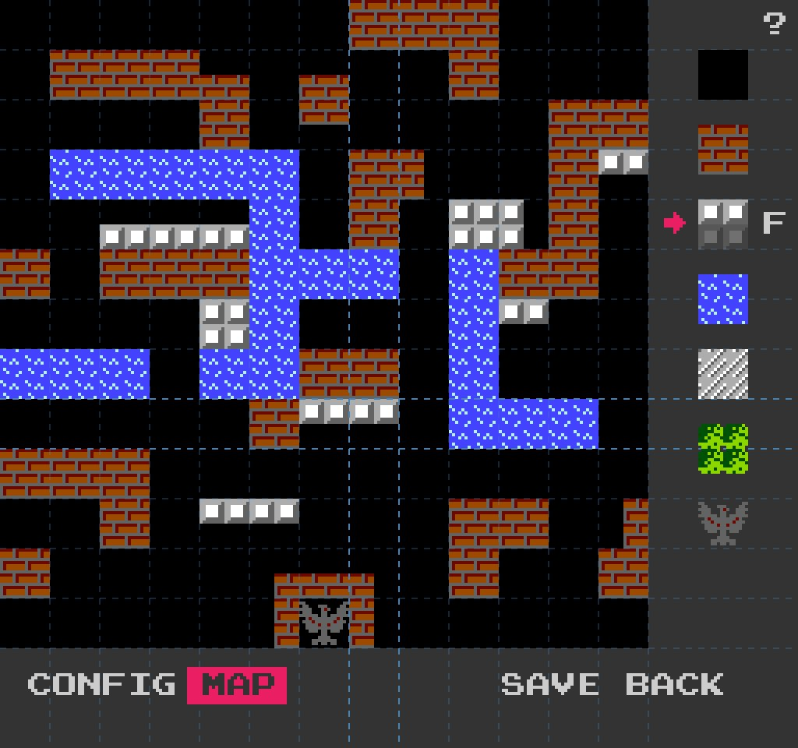
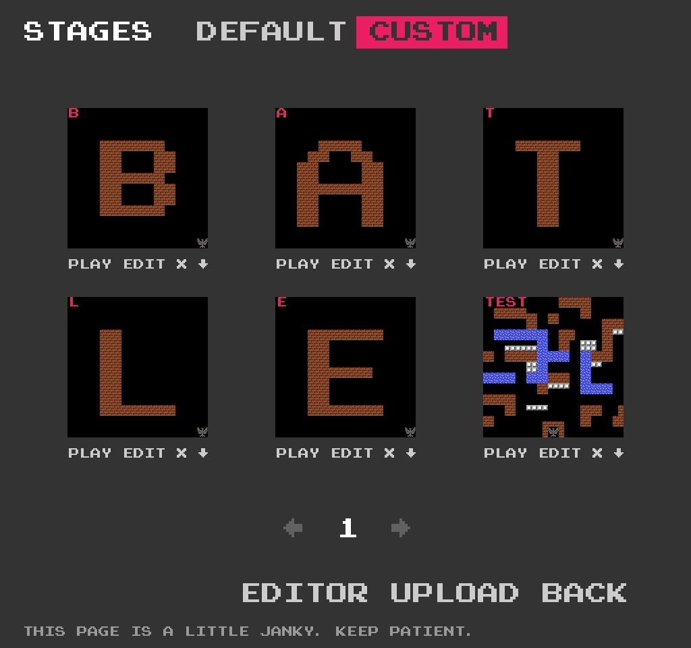
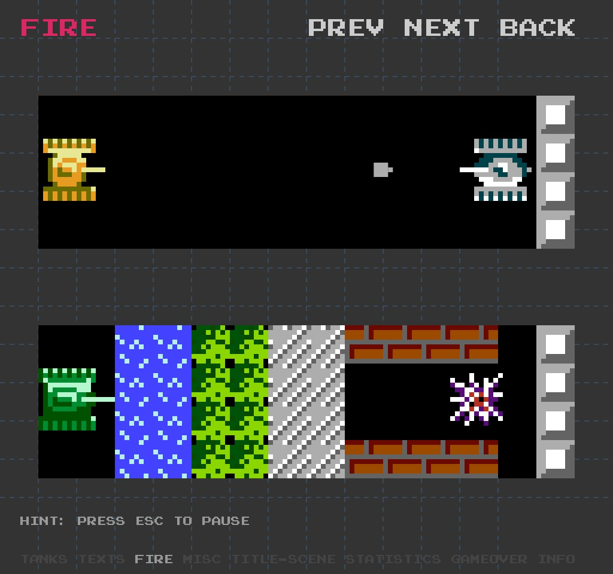
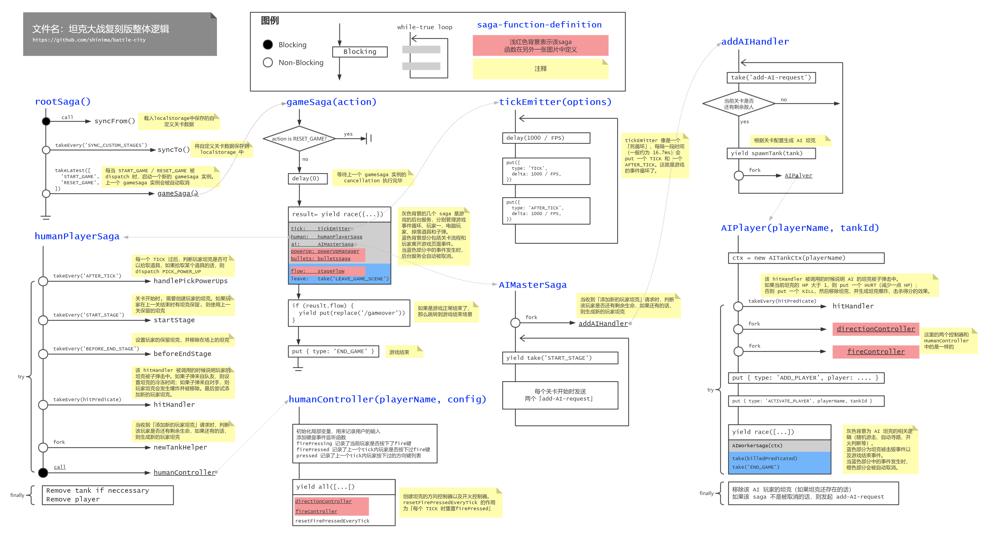

# 基于 React 的高质量坦克大战复刻版

坦克大战当年红遍大江南北，很多和我一样的九零后应该都有着对这个游戏的记忆。现在显示器分辨率越来越高，使用矢量图来实现像素风格游戏，可以获得非常高的展现质量。[该复刻版](http://shinima.pw/battle-city/) 是我花了很长时间折腾的坦克大战复刻版本，所有元素都使用矢量图（SVG）进行渲染，针对网页的交互方式重新设计了关卡编辑器，该复刻版新增了关卡选择功能、自定义关卡管理功能等，另外它还包括了一个 Gallery 页面用于展示所有的游戏元素，想必它一定可以勾起你的儿时回忆。

**针对鼠标交互设计的关卡编辑器**

点击鼠标，选择画笔类型，在地图中拖拽鼠标就即可完成关卡配置，再也不用担心游戏手柄按得手酸啦 (●ˇ∀ˇ●)。



**方便的自定义关卡管理页面**

完成自定义关卡配置之后，可以将关卡信息保存到浏览器缓存中（localStorage）。然后在关卡管理页面编辑/删除/下载这些关卡配置，当然你也点击关卡缩略图下方 PLAY 按钮直接开始自定义关卡。



**放大了很多倍的 Gallery**

浏览 Gallery 页面来更全面地了解游戏中的各个元素。



[点击这里开始游戏](http://shinima.pw/battle-city/)。欢迎大家在 GitHub 上 star [本项目](https://github.com/shinima/battle-city)，如果发现游戏的 BUG 也可以直接发起 issue。本文后面的内容会大致介绍整个游戏的开发过程，对 React / Redux 感兴趣的前端同学可以继续往下看。

---

复刻版主要包括了下面五个方面的内容：素材、数据、展现、逻辑、AI。

## 一、素材

素材主要包括了以下几个方面的内容：

1.  图片素材：例如坦克的形状/颜色, 各种地形的形状等；
2.  关卡配置：每一关的战场地形配置，一关内会出现的敌对坦克的数量和等级；
3.  数值配置：例如子弹的速度，坦克的移动速度，道具铲子的持续时间等；
4.  游戏场景：游戏开始/结束场景，关卡结算场景等；
5.  音效（该复刻版的音效部分尚未完成）。

#### 图片素材

图片素材可以从网上下载得到， [该位图图片](https://github.com/shinima/battle-city/blob/master/resources/General-Sprites.png) 中包含了坦克大战绝大部分的图片素材。因为复刻版使用矢量图来展现画面，所以需要对位图进行矢量化处理。位图图片中的每个像素点, 都需要被转换为 SVG 中 1x1 的小矩形，这样整个游戏才会呈现像素风格。素材也可以适当地转换为 SVG 矩形元素或是 SVG 路径元素，以减少元素的数量，提升渲染性能。

大部分的素材，都是通过手工输入的方式得到的。例如坦克生成时的闪光效果，其颜色为白色，形状可认为是若干个矩形的叠加，我们使用若干个矩形元素就能表示闪光效果了。

对于一些比较复杂的素材，我将其分解为若干个部分，对每个部分进行矢量化，然后组装起来得到整体素材。例如我们可以将坦克分解为以下几个部分：

```
左侧的轮胎(left-tire)： 轮胎的背景色 & 轮胎上的花纹
右侧的轮胎(right-tire)：轮胎的背景色 & 轮胎上的花纹
坦克主体(tank-body)： 坦克主体的轮廓 & 坦克主体上的装饰
坦克炮管(gun)：一个矩形
```

一些素材的形状具有一定的模式，此时可以采用循环/分支的方式来生成所需要的 SVG 元素。例如一个完整的砖墙的大小为 16x16，但是砖墙的左上/右上/左下/右下四个部分是完全一样的，有了砖墙左上部分(8x8)的 SVG 之后，使用循环可以生成整个砖墙。

一些素材的形状非常不规则，难以通过手工的方式进行输入，例如子弹/坦克的爆炸效果，掉落道具的形状。我使用脚本读取原始素材中每个像素点的颜色值，然后将其转换为一个字符，用于保存该点的颜色值。React 渲染时, 根据字符渲染出对应颜色的矩形(1x1)。该方式可以方便地对素材进行矢量化，但是会导致 React 组件数量大大增加，降低渲染效率。

素材矢量化的过程非常灵活，复刻版充分利用了循环/分支/组合简化了矢量化过程。一些工具组件，例如 `<Pixel />` 和 `<BitMap />` ，在矢量化的过程中提供了很大的便利。一项素材完成矢量化之后，可以将其放在 Gallery 页面进行查看，和原始素材进行对比，方便改正其中的错误。

#### 关卡配置

[坦克大战 WIKI](https://strategywiki.org/wiki/Battle_City)上有完整的关卡配置表，根据配置表使用关卡编辑器生成关卡配置 json 文件即可，关卡列表中已经列出了所有游戏自带的关卡，玩家也可以使用关卡编辑器创建自定义关卡，自定义关卡数据将保存在 localStorage 中。

#### 数值配置

一部分数值配置比较明显，多玩几遍原版游戏就可以找到规律，例如玩家的坦克数量、坦克升级过程、不同类型坦克子弹效果、击毁不同类型坦克的得分等。其他数值配置的获取较为繁琐，例如子弹飞行速度、坦克移动速度、爆炸效果各帧的持续时间，这一部分大都从原版游戏录像中获取。[该文件](https://github.com/shinima/battle-city/blob/master/docs/values.md) 中记录了一些我已经测量好的数值，可供参考。随着游戏的不断完善，该文件也会不断完善。

#### 游戏场景

坦克大战中的不同场景的区分度很大，而同一场景的变化较小，对原版游戏中不同场景进行截图，复刻版根据这些截图进行开发即可。

## 二、展现

经过第一步之后，游戏的素材被封装成了相应的 React 组件或数据项，以方便后续使用，这一步将利用这些元素创建出游戏界面。坦克大战游戏包括了若干页面（游戏页面、标题页面、关卡选择页面、关卡列表页面、关卡编辑页面等），文件 _app/App.tsx_ 中使用了 react-router 来管理这些页面组件，这样一来玩家也可以通过手动在地址栏上输入地址直接执行操作（例如直接开始某个关卡）。

React 的组件非常容易被组合，整个游戏的展现过程也是 react 组件不断组合的过程。下图是游戏中主要场景`BattleField` 的结构，可以看出 `BattleField` 组件由许多不同的组件组合而成，游戏中的其他组件也类似，归根结底由第一步中的素材组合而成。

```jsx
export class BattleField extends React.PureComponent {
  render() {
    return (
      <g className="battle-field">
        <rect width={13 * BLOCK_SIZE} height={13 * BLOCK_SIZE} fill="#000000" />
        <RiverLayer rivers={rivers} />
        <SteelLayer steels={steels} />
        <BrickLayer bricks={bricks} />
        <SnowLayer snows={snows} />
        <Eagle x={eagle.x} y={eagle.y} broken={eagle.broken} />
        <g className="bullet-layer">{bullets.map((b, i) => <Bullet key={i} bullet={b} />)}</g>
        <g className="tank-layer">
          {activeTanks.map(tank => <Tank key={tank.tankId} tank={tank} />)}
        </g>
        <ForestLayer forests={forests} />
        <g className="power-up-layer">
          {powerUps.map(p => <PowerUp key={p.powerUpId} powerUp={p} />)}
        </g>
      </g>
    )
  }
}
```

**React 性能优化**

复刻版中组件较多，组件变化频率快（理想情况下是每秒 60 帧），如果不对 react 渲染进行优化，整个游戏最终十分卡顿（5 帧/秒左右）。

优化一： 应用 [`React.PureComponent`](https://reactjs.org/docs/react-api.html#reactpurecomponent) 来过滤掉不需要的 re-render。游戏运行时，只有一小部分的组件会不断更新（例如坦克和子弹），大部分的组件（例如游戏中的地形元素）保持不变。这些不怎么变化的组件，在很多时候，前后两次接收到的 props 是相等的（shallow-equal）。让组件继承自 `React.PureComponent` ，就可以跳过该组件大部分额外的 re-render 。经过该步优化后，整个游戏的帧率大幅上升，大部分情况下可以到达 60 FPS。对于那些一直在变化的组件（例如子弹等），应用 PureComponent 的收益很小，也许 React.Component 更为合适。不过我在实际编程中也没考虑那么多，全盘使用了 PureComponent。

优化二： 经过优化一之后游戏在**短时间内生成大量组件**的情况下仍会出现掉帧的现象，例如坦克爆炸效果出现的时候。优化一避免了组件更新时重复渲染，但无法优化组件加载时的初次渲染过程，当组件复杂的时候，组件初次渲染就会有较大的开销。[这篇文章中提到了使用离屏画布提升 canvas 性能](https://www.html5rocks.com/zh/tutorials/canvas/performance/)，优化二的思路也是类似：**将组件渲染的内容保存到 SVG 图片中，下次渲染时直接使用准备好的图片。** 游戏中的爆炸效果、地形元素等组件的内容较为固定，其内容保存为图片后可以被多次复用。该优化实现代码如下：（[完整版代码](https://github.com/shinima/battle-city/blob/master/app/hocs/Image.tsx)）

```jsx
import { renderToStaticMarkup } from 'react-dom/server'

const svgns = 'http://www.w3.org/2000/svg'
// imageKey 到 object-url 的映射，一个 imageKey 对应了一张保存好的图片
const cache = new Map()

class Image extends React.PureComponent {
  render() {
    const { imageKey, width, height, transform, children } = this.props
    if (!cache.has(imageKey)) {
      const open = `<svg xmlns="${svgns}" width="${width}" height="${height}">`
      const string = renderToStaticMarkup(<g>children</g>)
      const close = '</svg>'
      const markup = open + string + close
      // 使用 react-dom/server 来生成 SVG 图片
      const blob = new Blob([markup], { type: 'image/svg+xml' })
      const url = URL.createObjectURL(blob)
      cache.set(imageKey, url)
    }
    return <image transform={transform} href={cache.get(imageKey)} />
  }
}

// 其他地方像这样使用 <Image />
class OtherComponentUsingImage extends React.PureComponent {
  render() {
    return (
      <Image imageKey="Forest" transform="translate(32, 0)" width="16" height="16">
        {imageContent}
      </Image>
    )
  }
}
```

应用优化二之后，即使在坦克爆炸、关卡地图加载等情况下，游戏依然能保持流畅。

## 三、数据

该复刻版使用 Redux 来管理数据，数据结构使用来自 Immutable.js 的 Map、List 等。reducer 层级整体较为扁平，不同方面的数据由各自的 reducer 进行维护，root reducer 将多个子 reducer 合并起来。下面是整个游戏大致的数据结构，`time` 是整个游戏的时钟，`game` 记录了若干游戏状态（当前关卡名称、是否暂停、玩家的击杀统计等），`players` 记录了游戏中所有的玩家。除了上述三个字段，其他各个字段存放的数据都直接对应了**游戏场景中出现的内容**，这点从字段名称中应该也能看出来。

```typescript
// 整个游戏的数据结构
interface State {
  time: number
  game: GameRecord
  players: PlayersMap
  // 以下每个字段都对应了「场景中显示的内容」
  bullets: BulletsMap
  explosions: ExplosionsMap
  map: MapRecord
  tanks: TanksMap
  flickers: FlickersMap
  texts: TextsMap
  powerUps: PowerUpsMap
  scores: ScoresMap
  // other reducers...
}
```

该复刻版使用 TypeScript 来进行开发，所有数据结构都包含了静态类型，在 VSCode 中将鼠标悬停在变量上方就可以直接看到变量的类型。游戏还包含了许许多多其他类型的数据，这里不进行展开解释，感兴趣的同学可以直接查看[源代码](https://github.com/shinima/battle-city/blob/master/app/types/index.ts)。Redux 中，我们需要使用 Action 来封装「对 state 的修改」，复刻版中的 action 列表可以查看[该文件](https://github.com/shinima/battle-city/blob/master/app/utils/actions.ts)，大部分 action 的含义可以直接从其命名中看出来，该文件中的 action 的抽象层级比较低，描述的内容较为简单，游戏中的某个事件往往需要使用多个 action 才能描述，这也是使用 redux-saga 的原因之一。

## 四、逻辑

从上面 BattleField 的渲染代码中也可以看出，游戏的展现取决于游戏的数据，数据发生变化时，游戏会更新视图来反映最新的数据，而游戏逻辑的目标就是 **根据用户输入和游戏规则维护 Store 中的游戏数据**。游戏的逻辑完全基于 redux-saga 实现，入口位于 _app/sagas/index.ts_。游戏逻辑较为复杂，代码量很大，我画了一张 saga 的结构图用来帮助理解游戏逻辑，在这里也就不用文字来说明游戏逻辑了。



[在这里查看上图的高清版本](https://raw.githubusercontent.com/shinima/battle-city/master/docs/imgs/saga-structure-overview.png)。上图中浅红色背景的 saga 在[另一张图片中](https://raw.githubusercontent.com/shinima/battle-city/master/docs/imgs/other-sagas.png)。

实现游戏逻辑比较重要的一点是，每一个 saga 实例都需要有明确的生命周期，这意味着我们需要回答下面这些问题：

* 一个运行中的 saga 实例代表着什么？
  * 例如一个 `playerSaga` 实例代表「一个正在游戏中的人类玩家」;
  * 一个 `playerController` 实例代表「一个人类玩家的控制器」。
* 什么时候创建 saga 实例？什么时候结束 saga 运行？
* 一个 saga 实例运行之后可能会管理一些游戏元素（子弹/地形/坦克等），如果该 saga 实例被 cancel，那么需要执行哪些清理操作？（cancel 时的清理操作一般放在 finally block 中）
* 一个 saga 实例运行时，可以保证哪些条件一定满足？
  * 例如 `AIWorkerSaga` 实例在运行时，可以保证该电脑玩家的坦克一直处于活跃状态（因为一旦电脑玩家的坦克被击毁，`AIWorkerSaga` 实例会立马被 cancel），这样在该 saga 内就不再需要判断坦克是否被击毁了。

## 五、电脑玩家逻辑

本复刻版中的 AI 目前还不是特别完善，和原版差别比较大，可能目前 AI 有些过强了。AI 仍然是基于 redux-saga 进行实现，大致模型可以认为是一个简单的分层状态机。复刻版对坦克控制（包括方向控制和开火控制）进行了抽象，人类玩家和电脑玩家拥有统一的控制器接口。该统一接口的抽象级别较低，只有三个指令：前进 / 转向 / 开火。类 `Bot` 基于该统一接口实现了 moveTo 指令，上层逻辑使用 moveTo 指令可以使坦克移动到指定位置。不过 moveTo 指令只支持横向和纵向的移动，且无法判断障碍物。函数 `followPath` 基于 moveTo 实现了坦克路径跟随功能，方便上层逻辑实现 AI。总体来说，随着不断的封装，指令的抽象级别越来越高。

为了实现 AI 逻辑，复刻版还提供了很多计算环境信息的函数，例如「坦克可以移动到哪些位置？」、「哪些位置可以击中老鹰，如果可以的话，需要多少次开火？」，「电脑玩家坦克和人类玩家坦克的相对位置，如果一方开火的话是否能够直接击中另一方？」。当然复刻版还实现了基于 BFS 的寻路算法，用来寻找一条当前位置到目标位置的路径。

有了上述的准备工作之后，AI 逻辑的实现就轻松多了。本复刻版中定义了两种 AI 模式：

1.  wanderMode 瞎逛模式：在此模式下，AI 坦克会随机选取一个目标位置，使用寻路算法计算一条到目标位置的路径，然后使用 `followPath` 一直沿着该条路径进行移动。在路径跟随过程中，AI 坦克会根据坦克前方的游戏元素和一个随机值来决定是否开火。
2.  attachEagleMode 攻击老鹰模式：在此模式下，AI 坦克会选取一个能击中老鹰的目标位置，然后计算一条路径并进行「路径跟随」，到达目标位置之后坦克会向老鹰进行开火。

大部分时候 AI 坦克都会处于瞎逛模式，瞎逛久了的话会随机进入攻击老鹰模式，实际玩下来，我发现这样的 AI 效果还不错。

## 总结

有趣、折腾、把 redux-saga 用了个遍。希望你能喜欢。

PS 再给自己写的开源工具打个广告吧，如果你在用 Node.js 写爬虫，并觉得从 HTML 文档中抓取 JSON 很麻烦的话，可以试试 temme 选择器，[该选择器用法详见这篇文章](https://zhuanlan.zhihu.com/p/31624732)。
