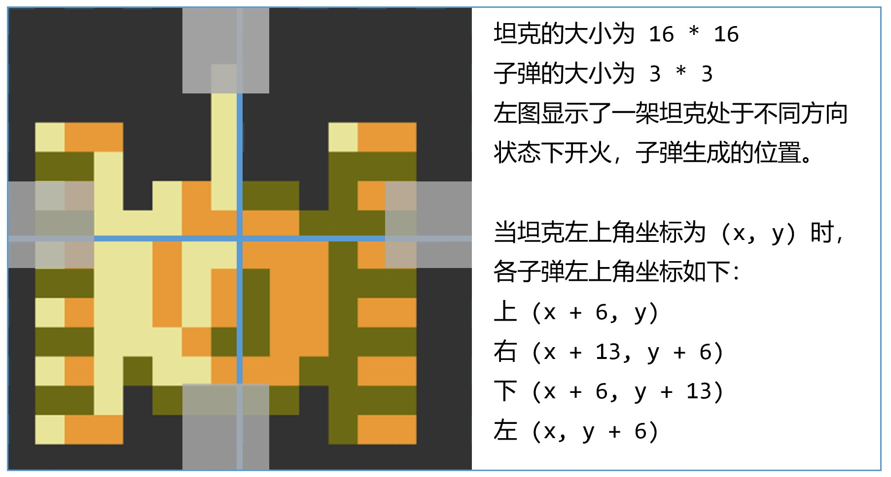

# battle-city 相关数值

默认时间单位为 毫秒 ms 其他单位: 1f = frame = 16.67ms 1s = 1000ms

默认距离的单位为 像素 px 其他单位: 1B = 1block = 16px

#### 坦克颜色[DONE]

包含掉落物品的坦克颜色 [red/8f other/8f]

AI armor tank HP 4 颜色 [green/1f silver/3f green/1f silver/1f]

AI armor tank HP 3 颜色 [yellow/1f silver/3f yellow/1f silver/1f]

AI armor tank HP 2 颜色 [green/3f yellow/1f green/1f yellow/1f]

AI armor tank HP 1 颜色 silver

player-1 的坦克颜色为 yellow

player-2 的坦克颜色为 green

**说明:**

*[red/8f other/8f]*表示*red 持续 8 帧, 然后 other 持续 3 帧, 然后回到开头, red 持续 8 帧, other 持续 8 帧...*, 如此循环往复

#### 坦克移动速度[DONE]

slow: 0.03px/ms

middle: 0.045px/ms

fast: 0.6px/ms

玩家坦克的移动速度为 middle; AI basic 移动速度为 slow; AI fast 移动速度为 fast; AI power 与 AI armor 移动速度为 middle

#### 子弹飞行速度[TODO]

todo 下面几个数值似乎有问题

Bot basic, Bot fast, Player basic 的子弹速度为 0.12px/ms; 其他坦克的子弹速度为 0.24px/ms

#### 子弹上限[DONE]

Player power 和 Player armor 的子弹上限为 2; 其余坦克的子弹上限 1

子弹上限表示一架坦克在场上的子弹数量最大值

#### 道具相关时间[DONE]

道具掉落 ICON 的闪烁时间: [消失/8f 出现/8f]

helmet 闪烁时间: 每个形状持续 2 帧左右

关卡开始时玩家自动获得的 helmet 持续时间: 135f

玩家坦克重生时自动获得的 helmet 持续时间: 180f

道具 helmet 的持续时间: 630f

道具 shovel, 总共的持续时间: 1268f. steel/1076f + (B/16f + T/16f) \* 6 次

#### 其他数值[DONE]

得分提示的出现时间 48f

#### 爆炸效果相关数值[TODO]

#### 其他 TODO

暂无

#### 子弹发射间隔[TODO]

玩家的子弹发射间隔为 ??? , 但受到子弹上限的影响, 所以子弹发射频率有上限

~~短距离射击时, 玩家坦克的子弹间隔取决于玩家手速~~

AI 坦克的子弹发射间隔还没进行测量

#### 子弹生成位置[DONE]

参考下图，与原版不一定一致

